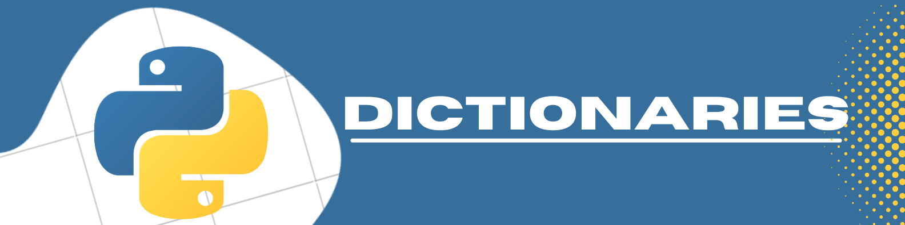

# python-dictionaries  

Auhtor:  Erin James Wills, ejw.data@gmail.com  

  

## Overview  

Code used to demonstrate how a python dictionary works.  Written in parts to explain the coding process.  

   

## Technologies    
*  Python

 

## Data Source  
Not applicable

 

## Setup and Installation  
1. Environment needs the following:  
    *  Python 3.6+   
1. Activate your environment
1. Clone the repo to your local machine
1. Navigate the terminal to the repo folder
1. In the terminal, run `python dictionary_example.py`  
